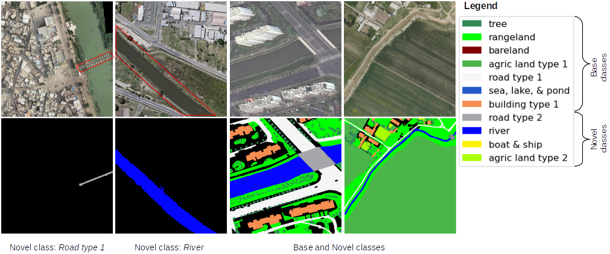

<div align="center">
	
## OpenEarthMap Land Cover Mapping Few-Shot Challenge </br> Generalized Few-shot Semantic Segmentation
### Challenge proposed by the [Geoinformatics Team of RIKEN-AIP](https://geoinformatics2018.com/) and co-organized </br> with the [3rd L3D-IVU Workshop](https://sites.google.com/view/l3divu2024/overview) @ CVPR 2024 Conference

<p></p>
</div>

<div align="center">
	
[](https://github.com/Naereen/StrapDown.js/blob/master/LICENSE)
<a href="https://pytorch.org/get-started/locally/"></a>

</div>

##
<div align="justify">
<p>
	We are excited to be seeing great ideas from across the globe working hard towards a better understanding of our environment. We look forward to having fun in our quest to obtain more 
	accurate semantic segmentation maps for practical applications of few-shot learning in remote sensing image understanding.	
	Let us come together to push the state-of-the-art generalized few-shot semantic segmentation (GFSS) learning methods to promote research in AI for social good.
</p> 
<p>
	
**Get involved! Check out the following links:** </br>
- Challenge Webpage [https://cliffbb.github.io/OEM-Fewshot-Challenge/](https://cliffbb.github.io/OEM-Fewshot-Challenge/)
- L3D-IVU Workshop @ CVPR 2024 Conference [https://sites.google.com/view/l3divu2024/overview](https://sites.google.com/view/l3divu2024/overview)
- Dataset Download [https://zenodo.org/records/10828417](https://zenodo.org/records/10591939)
- Submission Portal [https://codalab.lisn.upsaclay.fr/competitions/17568](https://codalab.lisn.upsaclay.fr/competitions/17568)
</p>
</div>

## Context
<div align="justify">

This repository contains the baseline model for the OpenEarthMap land cover mapping generalized few-shot semantic segmentation challenge. 
The motivation is to enable researchers to develop and benchmark learning methods for generalized few-shot semantic segmentation of high-resolution remote sensing imagery. 
The challenge is in two phases: the development phase is for developing and testing methods on a *valset*, and the evaluation phase is for tweaking and testing on a *testset* for final submission.

</div>

## Dataset
<div align="justify">

<p>	
This dataset extends the original 8 semantic classes of the [OpenEarthmap](https://open-earth-map.org/) benchmark dataset to 15 classes for **5-shot** generalized few-shot semantic segmentation (GFSS) task with **4 novel classes** and **7 base classes**. It consists of only 408 samples from the original OpenEarthMap dataset. The 408 samples are also split into 258 as *trainset*, 50 as *valset*, and 100 as *testset*. The *valset* is used for the development phase of the challenge, and the *testset* is for the evaluation phase. Both sets consist of *support_set* and *query_set* for GFSS tasks. A detailed description of the dataset can be found [here](https://zenodo.org/records/10591939), where it can also be downloaded. Below are examples of novel classes in the *support_set* (first two columns), and base classes + novel classes in the *query_set* (last two columns).
</p>
<p></p>
</div>

## Baseline
<div align="justify">

The PSPNet architecture with EfficientNet-B4 encoder from the [Segmentation Models Pytorch](https://github.com/qubvel/segmentation_models.pytorch?tab=readme-ov-file) GitHub repository is adopted as a baseline network.
The network was pretrained using the *trainset* with the [Catalyst](https://catalyst-team.com/) library. Then, the state-of-the-art framework called [distilled information maximization](https://arxiv.org/abs/2211.14126) 
(DIaM) was adopted to perform the GFSS task. The code in this repository contains only the GFSS portion. As mentioned by the baseline authors, any pretrained model can be used with their framework. 
The code was adopted from [here](https://github.com/sinahmr/DIaM?tab=readme-ov-file). To run the code on the *valset*, simply clone this repository and change your directory into the `OEM-Fewshot-Challenge` folder which contains the code files. Then from a terminal, run the `test.sh` script. as:
```bash
bash test.sh 
```
The results of the baseline model on the *valset* are presented below. To reproduce the results, download the pretrained models from [here](https://drive.google.com/file/d/1eLjfUJ2ajAMkJKCsoJr-MGSSzZ-LqDbR/view?usp=sharing). 
Follow the instructions in the **Usage** section, then run the `test.sh` script as explained. 

<table align="center">
    <tr align="center">
        <td>Phase</td>
        <td>base mIoU</td> 
	<td>novel mIoU</td> 
	<td>Average base-novel mIoU</td>
        <td>Weighted base mIoU</td> 
	<td>Weighted novel mIoU</td>
	<td>Weighted-Sum base-novel mIoU</td>
    </tr>
    <tr align="center">
        <td>valset</td>
        <td> 29.48 </td> 
	<td> 03.18 </td> 
	<td> 16.33 </td> 
	<td> 11.79 </td> 
	<td> 1.91 </td> 
	<td> 13.70 </td> 
    </tr>
   <tr align="center">
	<td>testset</td>
        <td> --- </td> 
	<td> --- </td> 
	<td> --- </td> 
	<td> --- </td> 
	<td> --- </td> 
	<td> --- </td> 
    </tr>   
</table>
The weighted mIoUs are calculated using `0.4:0.6 => base:novel`. These weights are derived from the state-of-the-art results presented in the baseline paper.

</div>

## Usage
<div align="justify">

The repository structure consists of a configuration file that can be found in `config/`; data splits for each set in `data/`; and  all the codes for the GFSS task are in `src/`. The testing script `test.sh` is at the root of the repo.
The `docs` folder contains only GitHub page files.

To use the baseline code, you first need to clone the repository and change your directory into the `OEM-Fewshot-Challenge` folder. Then follow the steps below:</br>
1. Install all the requirements. `Python 3.9` was used in our experiments. Install the list of packages in the `requirements.txt` file using `pip install -r requirements.txt`.
2. Download the dataset from [here](https://zenodo.org/records/10591939) into a directory that you set in the config file `oem.yaml`
3. Download the pretrained weights from [here](https://drive.google.com/file/d/1eLjfUJ2ajAMkJKCsoJr-MGSSzZ-LqDbR/view?usp=sharing) into a directory that you set in the config file `oem.yaml`
4. In the `oem.yaml` you need to set only the paths for the dataset and the pretrained weights. The other settings need not be changed to reproduce the results.
5. Test the model by running the `test.sh` script as mentioned in the **Baseline** section. The script will use the *support_set* to adapt and predict the segmentation maps of the *query_set*. After running the script, the results are provided in a `results` folder which contains a `.txt` file of the IoUs and mIoUs, and a `preds` and `targets` folder for the predicted and the targets maps, respectively.

You can pretrained your model using the *trainset* and any simple training scheme of your choice. The baseline paper used the [`train_base.py`](https://github.com/chunbolang/BAM/blob/main/train_base.py) script and base learner models of [BAM](https://github.com/chunbolang/BAM) (see the [baseline paper](https://github.com/sinahmr/DIaM?tab=readme-ov-file) for more info).
 
</div>

## Citation
<div align="justify">
For any scientific publication using this data, the following paper should be cited:
<pre style="white-space: pre-wrap; white-space: -moz-pre-wrap; white-space: -pre-wrap; white-space: -o-pre-wrap; word-wrap: break-word;">
@InProceedings{Xia_2023_WACV,
    author    = {Xia, Junshi and Yokoya, Naoto and Adriano, Bruno and Broni-Bediako, Clifford},
    title     = {OpenEarthMap: A Benchmark Dataset for Global High-Resolution Land Cover Mapping},
    booktitle = {Proceedings of the IEEE/CVF Winter Conference on Applications of Computer Vision (WACV)},
    month     = {January},
    year      = {2023},
    pages     = {6254-6264}
}
</pre>
</div>

## Acknowledgements
<div align="justify">

We are most grateful to the authors of [DIaM](https://github.com/sinahmr/DIaM?tab=readme-ov-file), [Semantic Segmentation PyTorch](https://github.com/qubvel/segmentation_models.pytorch?tab=readme-ov-file), 
and [Catalyst](https://catalyst-team.com/) from which the baseline code is built on.
</div>
